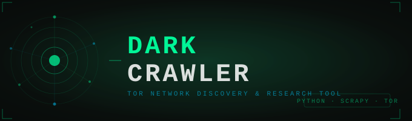
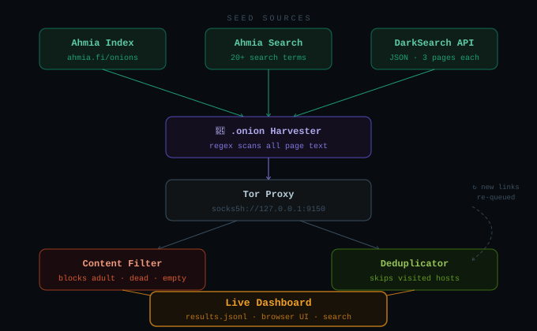
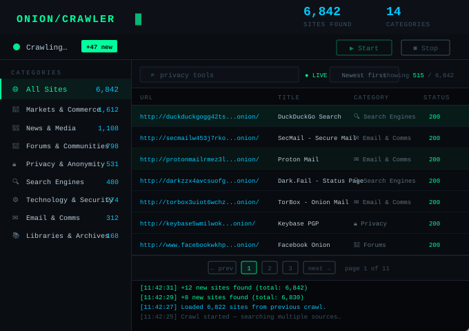

A research-oriented dark web crawler and live dashboard for discovering and categorizing `.onion` sites on the Tor network. Built with Scrapy, Python, and a browser-based UI with real-time updates.

---

## ⚠️ Legal & Ethical Notice

This tool is intended **strictly for security research, academic study, and journalistic investigation**.

- You are solely responsible for complying with all applicable laws in your jurisdiction
- Do not use this tool to access, store, or distribute illegal content
- The crawler includes filters to block adult content — do not remove or circumvent them
- Running this tool against sites without authorization may violate computer access laws in your country
- The authors accept no liability for misuse of this software

---

## Features

### Crawler
- 🔍 Seeds from multiple sources — Ahmia index, Ahmia search, DarkSearch API
- 🧅 Discovers new `.onion` sites by following links and scanning page text
- 🚫 Filters at crawl time — noise never reaches the database
  - Adult content
  - Scam shops (gift cards, CVV, clone cards, cashgod, etc.)
  - Dead pages (seized, DDoS redirects, "please wait" queues)
  - Noise titles (403, 404, nginx defaults, "under construction")
  - Thin pages (less than 80 characters of body text)
- 💾 Deduplicates by hostname — already-crawled sites are never visited twice

### Dashboard
- ⭐ **Top Picks** — highest scored sites surfaced automatically based on content quality
- 🔍 **Browse** — full table view with search, sort, and category filtering
- 🔖 **Bookmarks** — save sites to come back to
- 🗑 **Filtered Out** — noise/scam sites hidden but not deleted
- 📋 **Detail drawer** — click any site for full preview and personal notes
- 📊 **Score system** — every site scored by content richness, keywords, and category
- ⚡ **Live updates** — new sites stream in every 3 seconds while crawling
- 🗃 **SQLite backend** — fast full-text search across all 14 categories
- 🖥 **No command line needed** — start and stop crawls from the browser

---

## Requirements

- Python 3.9+
- Tor Browser **or** Tor Expert Bundle (must be running before crawling)
- Windows, macOS, or Linux

---

## Installation

**1. Clone the repo**
```cmd
git clone https://github.com/yourusername/Dark-Crawler.git
cd Dark-Crawler
```

**2. Install dependencies**
```cmd
pip install -r requirements.txt
```

**3. Start Tor**

| Method | Port |
|---|---|
| Tor Browser (easiest) — keep it open | 9150 |
| Tor Expert Bundle — run `tor.exe` | 9050 |

If using Tor Browser, make sure `middlewares.py` has `TOR_PROXY = "socks5h://127.0.0.1:9150"`.
If using Expert Bundle, change it to port `9050`.

---

## Usage

**Start the server:**
```cmd
python server.py
```

**Open your browser and go to:**
```
http://localhost:8765
```

From there you can start and stop crawls, search results live, and browse by category — all without touching the command line again.

---

## Project Structure

```
Dark-Crawler/
├── darkweb_crawler/
│   ├── spiders/
│   │   └── onion_spider.py   ← crawler logic, seed sources, content filters
│   ├── middlewares.py         ← Tor SOCKS5 proxy routing
│   ├── items.py               ← data model
│   └── settings.py            ← Scrapy config
├── server.py                  ← local web server + dashboard UI
├── scrapy.cfg
├── requirements.txt
└── README.md
```

---

## How It Works



1. **Seeding** — queries Ahmia and DarkSearch for dozens of search terms, harvesting `.onion` addresses from results
2. **Crawling** — visits each unique `.onion` homepage via Tor, saves title and text preview
3. **Discovery** — scans each page for new `.onion` addresses in links and raw text, queues them
4. **Filtering** — skips dead sites (non-200), empty pages, and adult content
5. **Deduplication** — tracks every visited hostname; previously crawled sites from `results.jsonl` are skipped on subsequent runs
6. **Categorization** — keyword matching assigns each site to one of 14 categories

---

## Dashboard



---

## Output

Results are saved to `results.jsonl` (one JSON object per line):

```json
{"url": "http://example.onion/", "title": "Example", "status": 200, "body_preview": "...", "timestamp": 1234567890}
```

---

## Categories

| Category | Description |
|---|---|
| 🔍 Search Engines & Indexes | Onion search engines and link directories |
| 📖 Wikis & Directories | Wiki-style link collections |
| 💬 Forums & Communities | Discussion boards and community sites |
| 📰 News & Media | News outlets and media organizations |
| 💭 Chat & Messaging | Chat platforms and messaging services |
| ✉️ Email & Communication | Webmail and email providers |
| ✍️ Blogs & Personal Sites | Personal blogs and portfolios |
| 🛒 Markets & Commerce | Marketplaces and shops |
| ⚙️ Technology & Security | Security research, tools, and tech |
| 🔒 Privacy & Anonymity | Privacy tools and resources |
| 📚 Libraries & Archives | Document archives and libraries |
| 📡 Leak & Whistleblower | Whistleblowing and leak platforms |
| ₿ Finance & Crypto | Cryptocurrency and financial services |
| 🖥️ Hosting & Services | Hosting providers and web services |

---

## Contributing

Pull requests are welcome. Please keep the adult content filters intact and do not add features that would make it easier to access or scrape illegal content.

---

## License

MIT License — see `LICENSE` for details.
